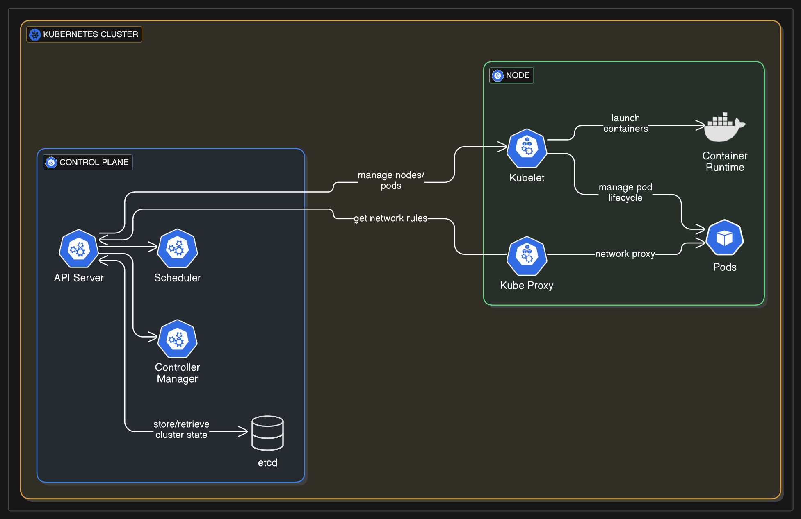

#  Kubernetes Components

## Control plane components

- **API Server**   : 
	- The API server is like a front end of the control plane. 
	- All the external and internal components communicate with the API server.
- **Controller Manager**   :
	- Runs various controllers that regulate the cluster state.
	- **Types of controllers**:
	    - **Node Controller**: Detects and responds when nodes go down.
	    - **Replication Controller**: Maintains desired number of pod replicas.
- **etcd**   :
	- A distributed key-value store to store all cluster state data (configurations, secrets, node states, etc.).
- **cloud-controller-manager**   :
	- Interacts with cloud provider APIs

## Node components

- **kubelet**   :
	- Ensures that the pods are running
- **Container runtime**   :
	- It is the software that runs containers (e.g., containerd, CRI-O, Docker).
- **kube-proxy**   :
	- Manages network rules and implements IP addresses and ports for services.
	- Provides basic load balancing by routing traffic to appropriate pod instances.
        

---